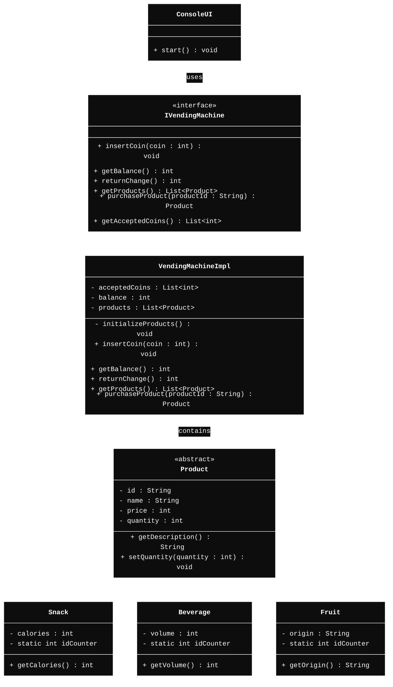

# Vending Machine
*This project implements a simple vending machine system in Java, featuring various product types and a console-based user interface.*

## **Additions**
  **Product Quantity Management**
    - Added `setQuantity(int quantity)` method in the `Product` class to manage stock levels.

  **Individual Products**
    - Implemented static `idCounter` in `Snack`, `Beverage`, and `Fruit` classes to ensure unique product IDs and added specific attributes (``calories``, ``volume``, ``origin``).

  **Accepted Coins Retrieval**
    - Added `getAcceptedCoins()` method in the `IVendingMachine` interface and its implementation to retrieve the list of accepted coin denominations.

## **Class Diagram**

